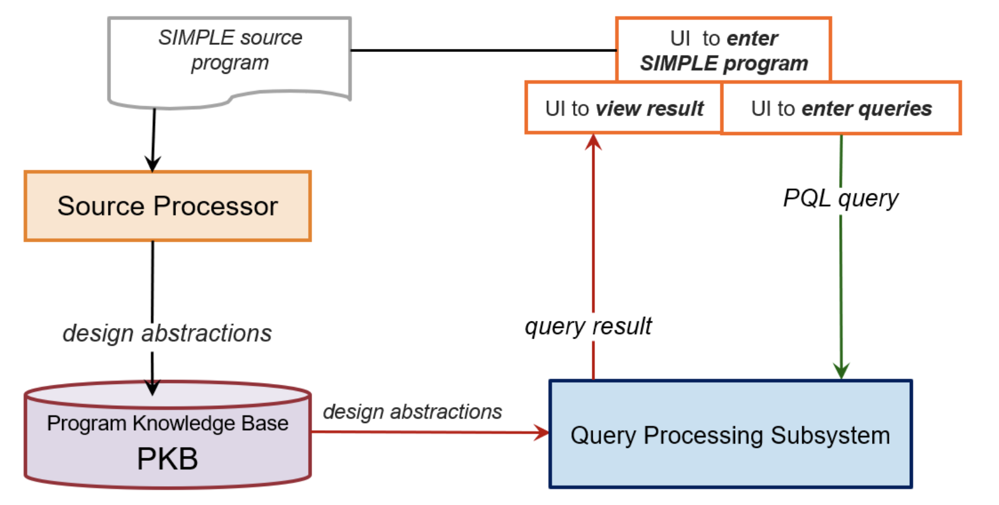

# Introduction

# Motivation for a Static Program Analyzer

A **Static Program Analyzer (SPA)** is an interactive tool that automatically answers queries about programs. We will design and implement a SPA for the SIMPLE programming language.

The SPA can be used by users (programmers) in the following way: 
1. John, a programmer, is given a task to fix a crashing error in a program.
2. He feeds the program into SPA for automated analysis. The SPA parses a program into the internal representation stored in a Program Knowledge Base (PKB).
3. He starts using the SPA to help him find program statements that cause the crash by entering queries. The SPA evaluates the queries and displays the results.
4. He analyzes query results and examines related sections of the program to locate the source of the error.
5. He finds program statement(s) responsible for an error and modifies the program to fix the error. He can ask the SPA with more queries to examine the possible unwanted ripple effects of the changes.

From the users' point of view, static analysis requires three actions:
1. Enter the source program
2. Enter queries
3. View query results

SPA works by:

1. Analyzing a [source program](https://nus-cs3203.github.io/course-website/contents/basic-spa-requirements/simple-programming.html) and extract relevant [program design entities](https://nus-cs3203.github.io/course-website/contents/basic-spa-requirements/design-entities.html), [program design abstractions](https://nus-cs3203.github.io/course-website/contents/basic-spa-requirements/design-abstractions.html), [Abstract Syntax Tree (AST)](https://nus-cs3203.github.io/course-website/contents/basic-spa-requirements/abstract-syntax-tree.html), and program Control Flow Graph (CFG)
2. Storing the information in a PKB
3. Providing the user with the means to ask queries written in a formal [Program Query Language (PQL)](https://nus-cs3203.github.io/course-website/contents/basic-spa-requirements/program-query-language%5Cintroduction.html)
4. Processing the PQL queries based on the information found in the PKB
5. Returning the results to the user

- The User Interface (UI) allows users to enter a source program written in SIMPLE.
- The **Source Processor** parses the source program. It extracts information and stores the information in the **PKB**.
- The UI also allows users to input PQL queries.
- The **Query Processing Subsystem** validates and evaluates the queries by making use of the information stored in the PKB.
- The UI then display the query results to the user.

