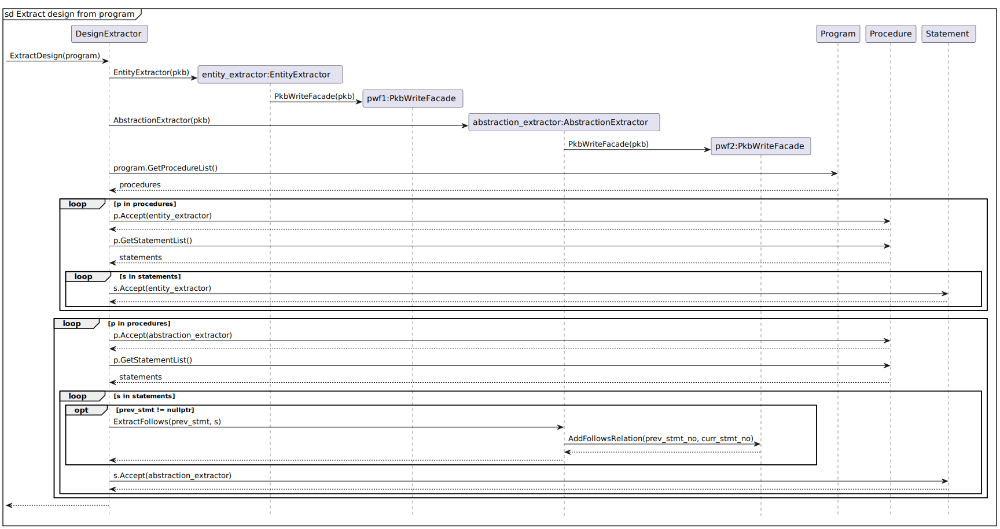
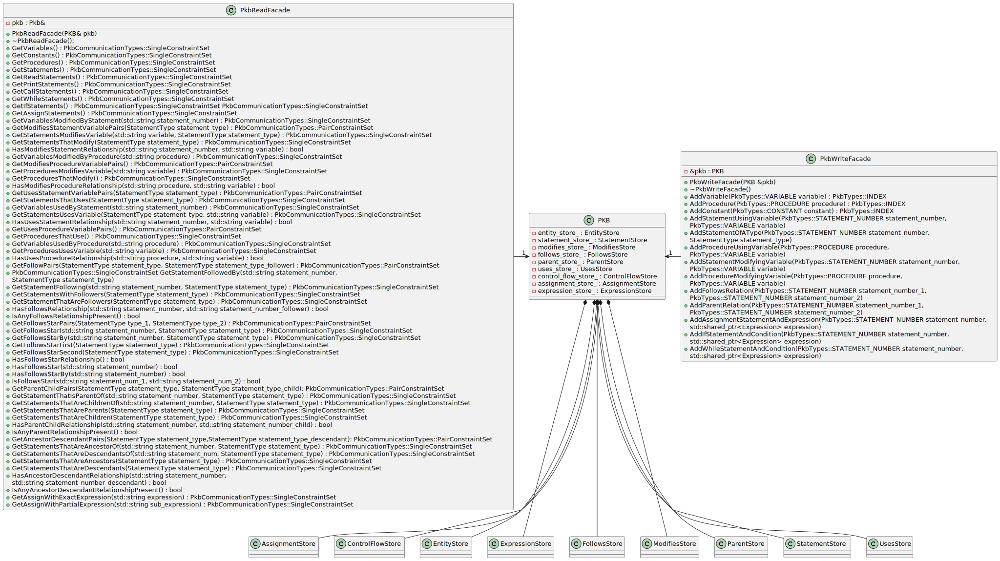

# Report for Milestone 1

Last Updated: 20th February 2023

## Source Processor

### Component Diagram

**Applications of design principles**

Information Hiding Principle: SP is isolated from the internal details of the respective facades (i.e. Tokenizer, Parser and Design Extractor)

**Use of design pattern**

Facade: Tokenizer, Parser and DesignExtractor class acts as a Facade by sitting between their respective internal components and SP. This helps to reduce the coupling between multiple subsystems by requiring them to communicate only through facades.

Note: Each component in the component diagram has public APIs.

<!-- [SP Components Public APIs](https://www.notion.so/322cf0d73e6147338f3159aa647fb6ae) -->

### Tokenizer Class Diagram

Link to Tokenizer class diagram SVG file:

**Application of design principles:**

- Don’t Repeat Yourself (DRY): By using polymorphism for Token and it’s subclasses, common behaviour can be defined in the superclass i.e., Token while also allowing implementation of different behaviour for each subclasses. This helps to prevent violating DRY.
- Liskov Substitution Principle (LSP): With the inheritance hierarchy for Token in Tokenizer class, it can just use Token to generalize the different types of Token as the method return type while still having the subclass substitute the superclass without breaking the program.

**Use of enums and hashmap**: enum was chosen to be used for Token’s type as apart from Name and Integer tokens, there is only a finite set of punctuations and operators (relational, conditional and arithmetic). Even if there is a need to extend it, we can simply add a new enum value and add a new key-value pair to the TOKEN_TYPES hashmap where key = token’s value (e.g., “+”) and value = PLUS (enum value). With this design, other parts of the code would not require changes and at the same time wouldn’t break. Also, with the use of hashmap, during the construction of tokens, the token’s type can be quickly (O(1) time) and easily identified without having to use additional if-else chain for it. Hence, it doesn’t violate OCP despite the use of enums in this case.

### Parser Class Diagram

Link to AST class diagram SVG file:

**Description:** The following is the structure of the AST generated by the parser. The abstract classes Statement and Expression allow extension of newer classes without breaking the working AST, since the calling methods depend on the abstract classes rather than the concrete classes.

Link to Parser class diagram SVG file:

**Description:** The above diagram shows the sub-components of the Parser. The Parser components uses the TokenStream returned by the Tokenizer to store the information as an AST.

**Use of Design Pattern:**
The Parser component uses the Factory pattern which allows an easy extension for adding more Statement and Expression Parsers (e.g. Call Statement) while providing the calling methods with an interface StatementParser and ExpressionParser to decouple the concrete implementations.

**Application of design principles:**

1. Single Responsibility Principle*:* Parser creation code is separated from the actual parsing of statements and expressions and the logic for parsing of each kind of Program node is implemented in the respective Parsers.
2. Open Closed Principle: Addition of new types of Statements and Expressions can be done with ease without breaking existing Parsers. This has been implemented via the Factory Method in the Factory Classes as well as through providing abstractions Statement and Expression to ensure the Program nodes are not depending on the concrete implementations
3. The Tree like structure of Parser following the AST structure provides modularity for each component and makes it easier to test, update and debug.

### DesignExtractor Class Diagram

Link to DesignExtractor class diagram SVG file:

**Description**: The DesignExtractor component uses the Visitor pattern which allows us to place the new behaviour of extracting design from AST into a separate class ParserVisitor and Entity instead of trying to integrate it into the existing ASTNodes (like Statement, Procedure, Variable, etc.).

**Application of design principles:**

1. Separation of Concerns Principle: We can separate the logic of extraction of information from AST into two different extractors where one deals only with entity extractions (EntityExtractor) and the other deals only with abstraction extractions (AbstractionExtractor).
2. OCP: The addition of new entities and abstractions can be done with ease without making changes to the existing implementation of the interface, Entity. For instance, if a new entity needs to be supported, we can just create a new class that implements Entity and a new method in EntityExtractor and AbstractionExtractor to implement the necessary extraction behaviours.

<!--  -->

**Final verdict**: Visitor is more suitable for our AST structure and it is easier to implement when there is a new entity/abstraction needed. It also helps to reduce the memory utilization throughout the program execution.

### Sequence Diagram

Link to SP’s Main Sequence Diagram SVG file:

**Description**: Once the user runs the SPA, the SIMPLE source code inputted will be processed by first tokenizing it via the Tokenizer followed by parsing it into an AST via the Parser and finally extracting the entities and abstractions from the AST via the DesignExtractor. If there is any SpaException that is thrown during the process, it will be catched and an error message will be displayed to the user.

Link to SP’s Design Extractor Diagram SVG file:

**Description**: When ExtractDesign(program) is called, the DesignExtractor will create an object for EntityExtractor and AbstractionExtractor respectively, which in turns create a PkbWriteFacade for each extractor. A list of procedures is retrieved from the program and there are 2 loops to loop through it. The first loop is used to make each procedure call Accept(entity_extractor) and for each statement in the procedure, it will also call Accept(entity_extractor). Similarly, for the second loop, each procedure calls Accept(abstraction_extractor) and for each statement in the procedure, it will also call Accept(abstraction_extractor). At the same time while looping through the list of statements of the current procedure, it will keep track of the previous statement and extract the Follows abstraction between the previous and current statement which in turn calls PkbWriteFacade’s AddFollowsRelation(prev_stmt_no, curr_stmt_no).

## Program Knowledge Base

### Component Diagram

**Applications of design principles**

Abstraction: PKB’s Interfaces ie PkbReadFacade and PkbWriteFacade provide a layer of abstraction by ensuring that QPS and SP interact with PKB only through the facades that host the API endpoints. By using these facades, the mechanics of the API endpoint subroutine is hidden, which improves the overall maintainability and scalability of the system. The abstraction layer also provides a level of indirection, which allows the PKB to be modified or extended without affecting the external components that depend on it.

**Use of design pattern**

Multiple Facade pattern is used for PKB in order to enhance its modularity and scalability. Two separate interfaces, PkbReadFacade and PkbWriteFacade, were designed to offer specific functionalities related to reading and writing data respectively. This approach helps to reduce the interdependence between different components of the SPA by assigning distinct responsibilities to each facade.

### Class Diagram

Link to PKB’s Main Class Diagram SVG file:

Description: The following diagram shows the facades of PKB along with the main PKB class which contains the stores. The stores classes have been represented in a short form manner because of space constraint. To compensate for the same, the UML diagram representation of stores has been added next.

### Stores Class Diagram

Link to PKB’s stores’ class diagram:

Description: The following digram consists of all the methods and members of design entity and design abstraction stores that belong in PKB.

### Other Classes

Link to PKB’s other classes’ class diagram:

Description: This diagram consists of other relevant classes that have utility methods, and typedefs that are being used across the PKB sub component.

**_(Note: This diagram is a part of the main class diagram, just mentioned separately due to space constraints)_**

### Sequence Diagram for PkbReadFacade

Link to PkbReadFacade Sequence Diagram:

Description: This sequence diagram illustrates how the a query containing a parent relation is read by PKB followed by the retrieval of records from the Parent store.

### Sequence Diagram for PkbWriteFacade

Link to PkbWriteFacade Sequence Diagram:

Description: This sequence diagram illustrates how the follows relation between two arguments is added to PKB with the help of the stores OneToOne and ManyToMany stores.

### PKB List of Abstract APIs

<!-- [PKB APIs](https://www.notion.so/864e1c5258fa43a58c6552a9af2a1e49) -->

**_(Note: The API list only contains write and read API endpoints for Modifies Relation. We haven’t included all the APIs because of space constraint)_**

### Major Design Decisions

**Application of design principles**

- **Don’t Repeat Yourself (DRY)** is applied to ensure that the stores for SIMPLE’s entities and design abstractions are represented in the stores only once.
  - In this way, PKB avoids duplication and ensures consistency across the entire program analysis process. This helps in imporving the accuracy and efficiency of the SPA, as well as to maintain and update the storage over time.
- **Open Closed Principle (OCP)** is applied to ensure that PKB is open for extension through addition of new design abstraction stores, but closed for modification to existing ones. This has been achieved by designing PKB in a modular and extensible way, such that new design abstractions can have new stores independent of the previous ones.
  - The relevant API endpoints can be added to the facades respectively, without modifying the existing implementation. In this way, PKB can be more easily extended and improved without introducing unnecessary risks or side effects.
- **Separation of Concerns** is applied by ensuring that the stores solely maintain information about the design entity or abstraction that they are concerned with. In addition, the facade of the PKB has been divided to containt write and read endpoints, which further enhances this principle.
  - By breaking down the facade in this way, the PKB can be more easily maintained, modified, and extended without introducing unnecessary complexity or coupling between different parts of the system.
- **Modularity** is evident through abstract data models such as OneToOne, ManyToMany, and OneToMany are container structures that enable us to establish and store relationships between various entities and abstractions of the Simple language.
  - These abstract data models comprise generic methods that can be flexibly utilized for processing queries at an internal level for Query Processing System (QPS) and for inserting rows into the stores via the Source Processor (SP).
  - By utilizing these abstract data models, we can avoid redundant code and ensure consistency across the program analysis process.
  - These models provide a modular approach that allows us to easily extend and modify the data model as necessary, which can enhance the overall efficiency, maintainability, and scalability of the program analyzer.

**Design Considerations and Final Verdict**

- **Data Structures**
  - We have created different associative template container wrappers namely OneToOneStore, ManyToManyStore, and OneToManyStore that have underlying abstract method implementations used to represent associations between different classes.
  - For storing different entities and abstractions, various data structures on a low-level were considered.
    - **When it is used:** Accessing and Retrieving based on criterion provided by QPS queries
    - **Alternative Solutions:**
      - A single key-value store that will contain an unordered map on the inside.
        - **Pros:** O(1) time complexity in accessing and retrieving elements via index; but **Cons:** The underlying data structure does not allow for duplicate keys to simulate a one-to-many relation that is a requirement for many SIMPLE design abstractions.
    - **Criteria Requirements:** Fast write and retrieval is necessary, because orderings is not a priority. Most of the queries are related to membership.
    - **Final Decision and Justification:** Unordered sets were used to store the low level entites in PKB. These were wrapped by the associative data containers which further helped in time complexity because of the storing information in several forms which helps different queries.
      - One very distinctive design decision was the use of redundant data structures in the associative classes by the names of forward and backward maps which had key-value and value-key mapping separately. This was done to ensure retrieval by keys and values are accomplished in constant time. In addition, a separate key set was stored in OneToOneStore that helped in constant time retrieval of all keys without needing the time to iterate over all of them.
      - We didn’t add the delete methods to the associative containers because of the problem definition that it is a Static Program Analyzer and the source is not changing anytime during the execution of SPA.
- **Design Pattern for the overall PKB sub component**
  - **Alternative Solutions:** Initially, we had planned to implement the Observor Pattern \*\*\*\*to ensure that events triggered by SP writing an object to PKB will automatically trigger multiple subroutines, such as updating QPS accordingly. We did not consider this design pattern as it was mentioned in class that SPA has a pipe filter architecture where things happen sequentially from SP to PKB to QPS. Hence this pattern would have been useful only when a particular event would have triggered the happening of several things simultaneously.
  - **Criteria Requirements:** Work well with the Pipe Filter architecture of the whole Static Program Analyzer. Store the data received from SP properly and retrieve them based on the queries from QPS. Things are happening in a seuquential manner, ie QPS will not query unless the design entites and abstractions are not stored in PKB.
  - **Final Decision and Justification:** Ultimately, a multiple facade pattern was chosen with separate PkbReadFacade and PkbWriteFacade interfaces providing a specific set of functionalities related to either reading or writing data. This ensured that PKB is more modular and scalable, as each facade provides a distinct set of responsibilities and reduces coupling between different components of SPA.

## Query Processing Subsystem

### Component Diagram

Description: QPS is composed of 2 main components, the Parser and the Evaluator.

**_(Note: For our class diagrams, we decided to keep methods that are relevant to show the design pattern/logic of the component and omitted helper functions)_**

### QueryParser Class Diagram

Link to QueryParser Diagram:

**Description:** The QueryParser class is a facade to mask the underlying code involved in tokenising, parsing and validating queries. It returns a Query object for the Evaluator to continue evaluation. If there is a Syntax or Semantic Error then a SpaException will be thrown.

### Validator Class Diagram

Link to QPS Validator Class Diagram:

**Description:** The validator handles the syntax and semantic validation of clauses (e.g. such that or pattern clause) in the parsing process.

### Evaluator Class Diagram

Link to QPS Evaluator Class Diagram:

**Description:** The evaluator uses an Abstract Factory Design pattern to get evaluation results for each clause. The resolving of constraints between multiple clauses is then done using the Result Class.

### QPS Sequence Diagram

Link to QPS Sequence Diagram:

**Description:** For every query, QPS will first pass the query to QueryParser for parsing. QueryParser with the help of QPSTokenizer will split the query by delimiter (;) into different query lines and for each different type of line relevant information is extracted. For clauses, the clause arguments’ syntax and semantics are validated with the help of validators as they vary across different clauses. QueryParser output a query object with extracted information and the query is evaluated using PqlEvaluator.

### **PqlEvaluator Sequence Diagram**

Link to PqlEvaluator Sequence Diagram:

**Description:** For evaluation of a query, PqlEvalautor first retrieved the selected synonym entity from PKB and stored it in a result table. Then it loops through all clauses to evaluate boolean clauses first. If any boolean clause evaluates to false, stop and return empty result. Another loop is then run on the remaining clauses and the immediate result is joined with the result table. Anytime the result table becomes empty the evaluation stops and returns empty result. At the end of the evaluation, projects the result and returns the query output.

### **List of abstract APIs**

<!-- [QPS APIs](https://www.notion.so/9694c3323145407797bcc14fdbfcab46) -->

### **Major Design Decisions**

**Application of design principles**

- Dependency Inversion Principle was applied by using a Query class such that PqlEvaluator and QueryParser depend on an abstraction rather than low level data structures.
- To adhere to Don’t Repeat Yourself, we abstracted out commonly used functions for handling query arguments in QPS components like validators or the ClauseEvaluators into a QueryUtil class. This was also done for commonly used string handling functions in StringUtil.
- To adhere to open-closed principle, we used design patterns like the Chain of Responsibilities Pattern to make the Validators open to extension. We also applied the Abstract Factory Pattern to make the Evaluator extensible.

**Use of design patterns**

- The use of the Chain of Responsibilities pattern in ClauseValidators allows us to handle different types of clauses differently by passing the clause along a chain of handlers until one handler can handle that particular clause type. Single responsibility principle is followed as each handler is only responsible for one group of clauses and open-closed principle is also adhered to as new handlers can be added without modifying existing handlers.
- The use of the Abstract Factory Pattern from the ClauseSyntax helps us to adhere to the Single Responsibility Principle because there are 2 product types to create: Such That Clause Evaluators and Pattern Clause Evaluators. If a single factory was used to create all the different Clause Evaluators, this factory would have 2 responsibilities. With the abstract factory pattern, the Pattern ClauseSyntax subclass would create the Clause Evaluators to handle Pattern clauses while the SuchThatClauseSyntax subclass creates the ClauseEvaluators to handle Such That Clauses. The abstract factory pattern also helps with Open-Closed Principle by making it easy to both add new evaluators and add new clause types.
- The use of the Façade pattern in the QPSParser is used to hide the subcomponents involved in the parsing process like the QpsTokenizer and the validators. This is to provide a simplified interface to PqlEvaluator and reduce coupling between the evaluator and parser component.

**Design Considerations and Final Decision**

Validator Design Pattern: Visitor or Chain of Responsibilities

Description of visitor pattern: Have a syntax visitor and a semantic visitor to perform the validation operations on each clause class.

Description of Chain of responsibilities pattern: Have different handlers to validate different clause types and pass the clause through the handler chain.

**Final Decision:** As for our clauses, we only have PatternClause and SuchThatClause classes, using visitor pattern here is not useful as the visitor for SuchThatClause would require a big if-else chain for different relationship clauses. Therefore, Chain of responsibilities better fits our current implementation.

Evaluator Design Pattern: Strategy or Factory

Description of strategy pattern: For each clause type, there will be a EvaluationStrategy concrete class e.g. FollowsEvaluationStrategy. These Strategy concrete class will implement a EvaluationStrategy interface. The PqlEvaluator will have to check the clause type of a ClauseSyntax then choose a EvaluationStrategy to execute.

Description of abstract factory pattern: Each ClauseSyntax will create their ClauseEvaluators. The PqlEvaluator will then get the evaluation result by invoking the ClauseEvaluator’s EvaluateClause() function.

**Final Decision:** Both are viable ways to implement evaluation. However, the abstract factory pattern better makes use of the polymorphism of the ClauseSyntax and code is better encapsulated since PqlEvaluator will not need to check the type of the ClauseSyntax.

Data Type for Resolving Constraints

Design Decision 1:Use intersection of unordered_sets to resolve constraints. Decision Decision 2: Use a vector of vectors to resolve constraints

Consideration of Time Complexity: Design Decision 2 results in more time spent to convert each set from PKB into a vector of vectors.

Consideration of extensibility: In design decision 1, implementing cross product will be difficult and handling multiple clauses will be hard.

**Final Decision:** Extensibility is more important and we can optimise the clause evaluators in other areas, such as evaluating Boolean constraints first to improve efficiency.

Data Type for Query

Design Decision 1: Use a tree, similar to AST for SP. Design Decision 2: Use a class.

Number of data structures: Only use 1 tree to represent a query compared to multiple data structures in a class e.g. a vector of Clause and a map of synonym to design entity.

Ease of implementation: Tree is more complex as nodes for all tokens need to be made. Traversal methods need to be written.

Ease of access: Tree is more complex when clause-chains get larger. Class is easier to access important information.

**Final Decision:** Use a class because compared to the SP Parser which needs to hold a lot of detailed information about the SIMPLE source program (e.g. abstractions, entities, statements etc) the information that we need to hold about the query is more limited. Furthermore, in view that there are likely to be more complex queries in the future, the ease of access of information when using a tree is worse.

## Test Strategy

### How was testing done?

- **Unit Testing**
  - Unit testing is done mainly on the public APIs of every module. The developers in charge of each component will identify these APIs as they progress with their implementation and break the components into smaller modules.
  - The person who implemented a module will be responsible to write test cases to verify that the implementation works as intended. Extensive test cases derived from module specifications should be written to cover as many edge cases as possible. The module being tested should also be well documented so that the code reviewer knows what to expect and potentially identify test cases that have been missed out.
- **Integration Testing**
  - Integration testing is done to verify the interaction between SP and PKB, and between QPS and PKB. Integration testing will start when a minimally workable version of the required components is done.
  - As more features are being rollout and tested with unit testing, more test cases will be added to the existing compilation of integration test cases to verify the new feature able to interact with other components and work as intended. This also serves to verify that the introduction of it does not break any of our existing code.
- **Autotester/System Testing**
  - We used pairwise testing by figuring out the discrete combinations of Query calls based on the arguments for single clauses.
  - For multiclause arguments, we tested varying levels of dependencies and shared synonyms between the clauses.
  - We tested multiclause arguments for all such that clauses with a pattern clause. For invalid queries, we created test cases for both syntax error and semantic error cases.

### Test Statistics

By type

There are 384 unit test cases, 38 integration tests and 277 Autotester tests.

By component (unit tests)

**SP →** 61 unit tests

**PKB →** 86 unit tests

**QPS →** 213 unit tests

**General and Util →** 24 unit tests

By component (integration tests)

**SP AbstractionExtractor with PkbWriteFacade →** 7

**SP EntityExtractor with PkbWriteFacade →** 16

**QPS with PKBReadFacade →** 15

### Automation approach

As of milestone 1, we did not automate the autotester. However, a Python script was created to automate the running of all autotester tests for future milestones.

### Bug handling approach

Bugs are kept track of using GitHub Issues Tracker, the team will then try to locate the cause of the bug. Developers in charge of the component will be assigned the issues to fix it.

## Plan for Milestone 2

Given is a Gantt chart highlighting the proposed plan for Milestone 2.

