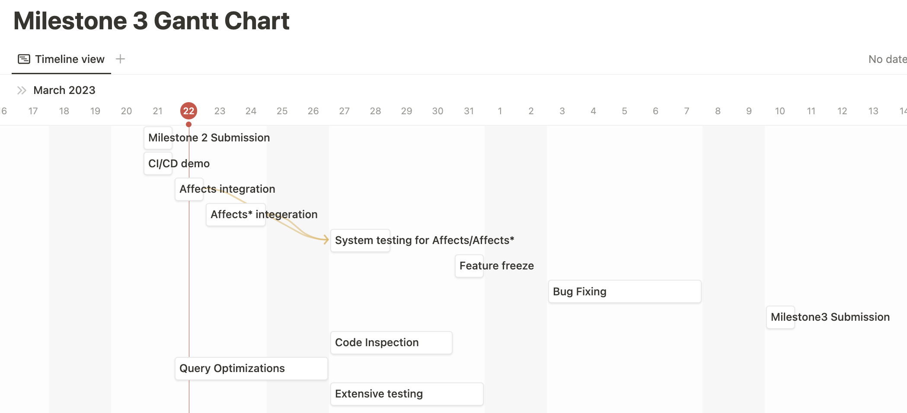
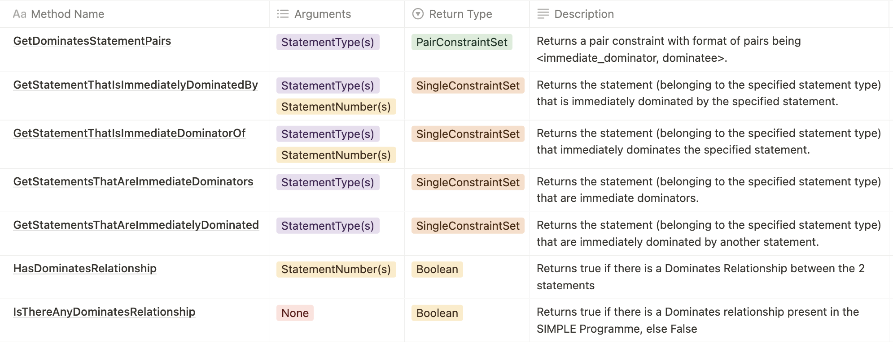
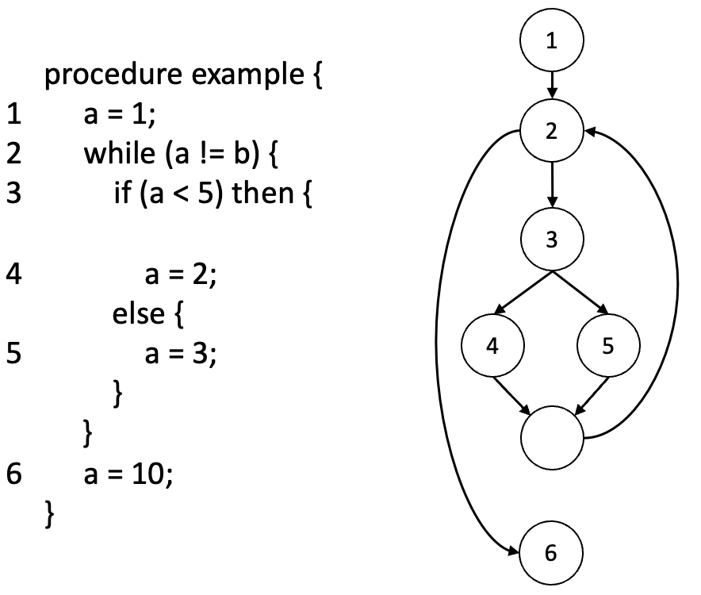

# Report for Milestone 2

Last Updated: 20th March 2023

## Plan for Milestone 3

For Milestone 3, we are planning to complete the implementation of Advanced SPA alongside an increased focus on testing and benchmarking the code for efficiency.

**Objectives**

- Completion of Affects/Affects\* relation extraction and relevant API
- Continuation of the testing strategy used in Milestone 1 & 2
- Increased testing by covering more aspects, especially branch coverage
- Improve on Integration testing to check for all API methods before components



## Extension Proposal

### Definition of the Extension

We are planning to introduce the `Dominates/Dominates*` design abstraction to SIMPLE language. The respective abstractions are defined as follows:

`Dominates(s1, s2)` and `Dominates*(s1, s2)`

```
For any statements s1 and s2:

**Dominates(s1, s2)** holds if every execution path from the root node/statement
to s2 passes through s1 and s1 is the closest statement to s2
on any path from the root.

**Dominates*(s1, s2)** holds if statement s1 directly or indirectly dominates s2.

That is to say:
- Dominates(s1, s2) or
- Dominates(s1, s) and Dominates*(s, s2) for some statement s.
```

The PQL syntax for these abstractions is as follows:

```
Dominates : 'Dominates' '(' stmtRef ',' stmtRef ')'
DominatesT : 'Dominates*' '(' stmtRef ',' stmtRef ')'
```

Refer to appendix for an example with sample CFG.

### Changes/Additions Required for Components

**SP**

- The core model of the AST and CFG would not require any change. A new data structure for the dominator tree would be introduced to cater for the extraction of these abstractions.
- Dominator Tree extraction will be handled by the `DesignExtractor` after the CFG is extracted from the AST. We would need to introduce this new extraction inside the `DesignExtractor` and the dominator tree can be passed to the PKB to handle Dominates queries on the fly as well.

**PKB**

- In the PKB, we would need to store the dominator tree generated by the `DesignExtractor`. Optionally, `Dominates/Dominates*` relations can be stored in a store similar to other design abstractions inside of associative containers that can improve the amortized cost across similar queries. This is mainly for caching purposes, hence it is optional.
- This tree can be stored in a separate store that can be accessed by the PKB whenever a `Dominates/Dominates*` query is received.
- To handle `Dominates/Dominates*` queries, we would need to implement methods that traverse the dominator tree and check if one statement dominates another. These methods can then be used by the QPS to evaluate `Dominates/Dominates*` clauses.
- Overall, the PKB changes for `Dominates/Dominates*` queries would involve adding a store for the dominator tree, an optional store `Dominates/Dominates*` relations, and implementing methods to check for dominates relationships between statements.

**QPS**

- Such-that abstractions are abstracted into a `SuchThatClauseSyntax` class. We would need to incorporate Dominates abstractions into the validation process of `SuchThatClauseSyntax`.
- Abstraction evaluations in the Evaluator are handled by `ClauseEvaluator` concrete classes. We would need to incorporate Clause Evaluators for Dominates into evaluation process by implementing new Clause Evaluators.
- For optimisation, Dominates abstraction will need to be factored in during the clause sorting process, where we sort the clauses to minimize large cross-products.

### Implementation Details

**SP**

- `DominatorTreeExtractor` would take the CFG as the input and return the dominator tree. The naïve implementation would lead to an `O(n^2)` solution where we perform the Depth First Search after removing each node from the CFG and check which nodes are not visitable. The nodes not visitable are the ones indirectly or directly dominated by the node. After doing it for all the nodes we would get the nodes inside the subtree of each node in the dominator tree.
- To construct the tree we start from the nodes which have only one node in the subtree which would be the leaf nodes, then to subtrees of size 2 and keep building up the tree until we get the root which has the subtree size equal to all the nodes in the CFG. The root is the root of the dominator tree and is returned by the `DominatorTreeExtractor`.

**PKB**

- In the PKB, we will store the Dominator Tree as a tree data structure inside of `DominatorTreeStore`, with each node representing a statement in the program. Each node in the tree will have a pointer to its children, representing statements that the current statement dominates.
- For query processing, the PKB will provide APIs to allow for checking whether one statement dominates another or whether one statement dominates another indirectly or directly.
- These APIs will traverse the Dominator Tree and check the relationship between the statements, returning true or false accordingly. The implementation of these APIs will take advantage of the fact that the Dominator Tree has already been constructed and stored in the PKB, allowing for efficient query processing.
- Additionally, the PKB will provide APIs to allow for retrieving all statements that a given statement dominates directly or indirectly. This can be done by traversing the Dominator Tree starting from the given statement and adding each child node to a result set until all reachable statements have been added.

**QPS**

- For the validation process, we mainly need to extend existing constants referenced by validators. This is because we are using a chain of responsibilities pattern, so the existing handlers can handle the syntax and semantic validation of Dominates after adjusting the constants.
- Link to Milestone 1 QPS Validator Class Diagram to illustrate Chain-of-Responsibilities Pattern:


- Link to diagram with QPS Abstract Factory Pattern for Clause Evaluators with Dominates:


- For the evaluation process, we will need to adjust the factory code in SuchThatClauseSyntax to create a `DominatesClauseEvaluator` class and a `DominatesStarClauseEvaluator` class. We will then implement the code to call the respective PKB APIs in these ClauseEvaluator concrete classes. An example is shown below for `Dominates`:



**_(Note: The list of APIs for `Dominates_` will be similar; they have been ommitted for brevity)\***

- For optimisation, we are grouping the clauses into a `ClauseGroup` class and sorting them within groups using a priority queue which prioritise abstractions with lower overall scores.
- To factor in `Dominates` abstractions, we mainly need to adjust the constant maps that hold the scores assigned to each `ClauseType`.
- `Dominates` will be prioritised before Next, similarly so for `Dominates*` with `Next*`. As compared to `Next`, `Dominates` has a more specific definition, so there are likely less values in the intermediate result table for a smaller cross-product.

### Plausible Challenges

**SP**

- There are faster algorithms (example: [Lengauer, Thomas; Tarjan, Robert Endre Fast algorithm for finding dominators in a flowgraph](https://dl.acm.org/doi/10.1145/357062.357071)) available and thus would require a proper understanding of the algorithms, implementation and testing for the correctness of the dominator tree built.

**PKB**

- Large Tree Size: The size of the Dominator Tree can be very large, especially for large programs with many basic blocks. Traversing such a large tree can be time-consuming and may require a lot of memory.
- Since PKB is already following OCP, the challenges with respect to the incorporation of this extension should be minimal, only limited to the implementation of efficient algorithms doing the traversals.

**QPS**

- With Dominates abstraction, there will be more abstractions that need to be calculated on the fly, which means more optimisations are required. One additional thing that we could work with PKB to implement is a cache for abstractions like Dominates using PKB stores.

### Benefits

| Benefit                        | Explanation                                                                                                                                                                              |
| ------------------------------ | ---------------------------------------------------------------------------------------------------------------------------------------------------------------------------------------- |
| Improved program understanding | Developers can understand which statements are essential for the control flow of the program and which ones are not.                                                                     |
| Code optimization              | For example, if a program contains a statement that is dominated by another statement, the dominated statement can often be eliminated without affecting the correctness of the program. |
| Bug detection                  | For example, if a program contains a loop with an exit condition that is not dominated by the loop header, the loop may never terminate, resulting in an infinite loop.                  |

### Appendix

### Example for Dominates

Link to an example demonstrating `Dominates/Dominates*` relationship in a CFG for SIMPLE code:



`Dominates(2,3)`: True because every execution path from the root node (1) to node 3 will pass through 2 (only path is 1 → 2 → 3) and 3 is the closest node to 2.

`Dominates(2,5)`: False because 5 is not the closest node to 2.

`Dominates*(2,5)`: True because every execution path from the root node (1) to node 5 will pass through 2.

`Dominates*(3,6)`: False because there is an execution path (1 → 2 → 6) which does not pass through 3.
