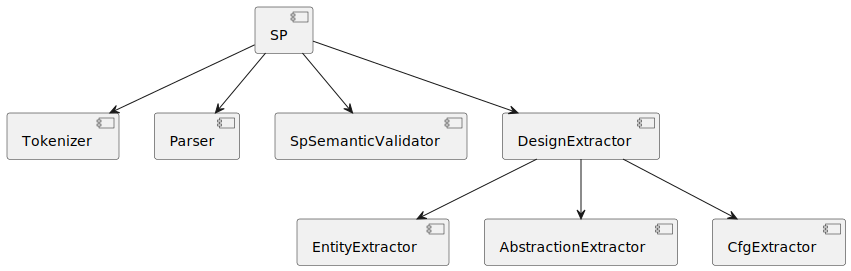
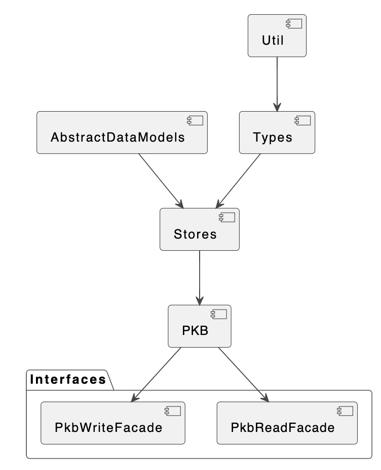
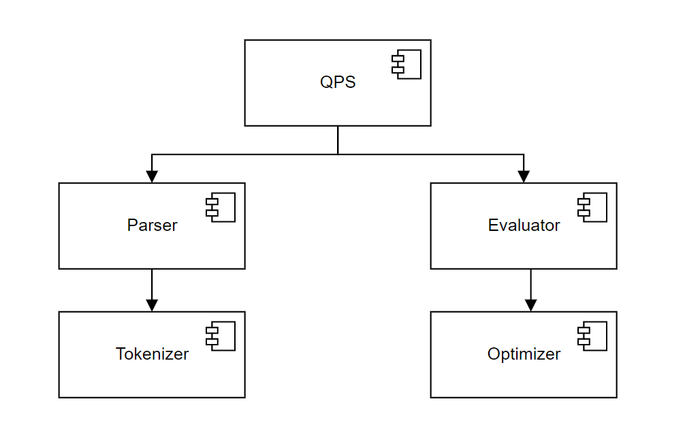
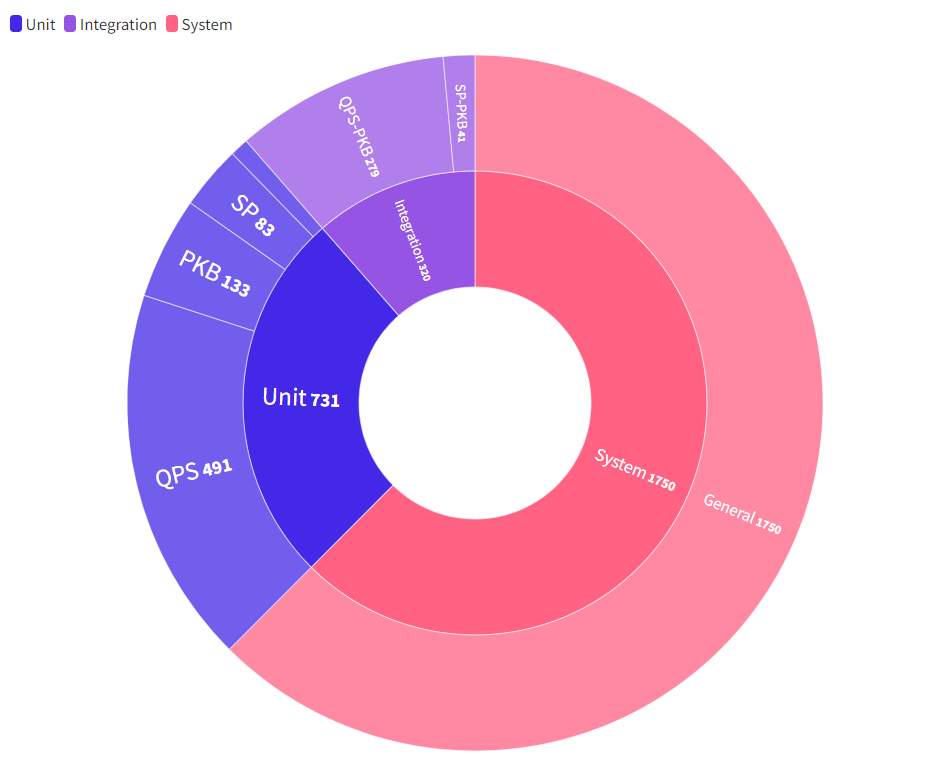
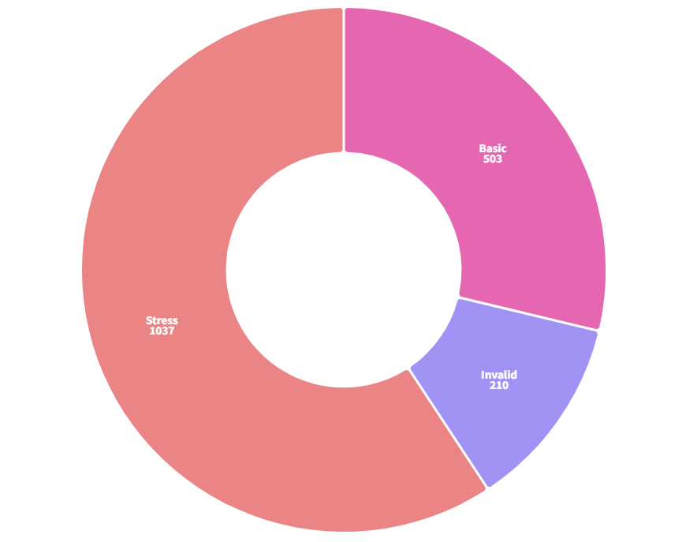

# Report for Milestone 3

## Source Processor

### Component Diagram

High-level architecture of SPA with SP component and the various DesignExtractors 

**Applications of design principles**

Information Hiding Principle: SP is isolated from the internal details of the respective facades (i.e., `Tokenizer`, `Parser`, `SpSemanticValidator` and `DesignExtractor`)

**Use of design pattern**

Facade: `Tokenizer`, `Parser`, `SpSemanticValidator` and `DesignExtractor` class acts as a Facade by sitting between their respective internal components and SP. This helps to reduce the coupling between multiple subsystems by requiring them to communicate only through facades. 

Note: Each component in the component diagram has public APIs. 

### Tokenizer Class Diagram

Link to Tokenizer class diagram SVG file: 
[https://www.dropbox.com/s/avp30pbqm2jubxi/SP-Tokenizer.svg?dl=0](https://www.dropbox.com/s/avp30pbqm2jubxi/SP-Tokenizer.svg?dl=0)

**Application of design principles:**

- Don’t Repeat Yourself (DRY): By using polymorphism for `Token` and it’s subclasses, common behavior can be defined in the superclass i.e., `Token` while also allowing implementation of different behavior for each subclass. This helps to prevent violating DRY.
- Liskov Substitution Principle (LSP): With the inheritance hierarchy for `Token` in `Tokenizer` class, it can just use `Token` to generalize the different types of Token as the method return type while still having the subclass substitute the superclass without breaking the program.

**Use of enums and hashmap**: enum was chosen to be used for Token’s type as apart from Name and Integer tokens, there is only a finite set of punctuations and operators (relational, conditional and arithmetic). Even if there is a need to extend it, we can simply add a new enum value and add a new key-value pair to the `TOKEN_TYPES` hashmap where key = token’s value (e.g., “+”) and value = `PLUS` (enum value). With this design, other parts of the code would not require changes and at the same time wouldn’t break. Also, with the use of hashmap, during the construction of tokens, the token’s type can be quickly (O(1) time) and easily identified without having to use an additional if-else chain for it. Hence, it doesn’t violate OCP despite the use of enums in this case.

### Parser Class Diagram (AST)

Link to AST class diagram SVG file: [https://www.dropbox.com/s/hjlulnr4iinim8w/AST.svg?dl=0](https://www.dropbox.com/s/hjlulnr4iinim8w/AST.svg?dl=0)

**Description:** The following is the structure of the AST generated by the parser. The abstract classes `Statement` and `Expression` allow the extension of newer classes without breaking the working AST since the calling methods depend on the abstract classes rather than the concrete classes.

### Parser Class Diagram (Actual Parser)

Link to Parser class diagram SVG file: [https://www.dropbox.com/s/oo48n412g9o8b2n/Parser.svg?dl=0](https://www.dropbox.com/s/oo48n412g9o8b2n/Parser.svg?dl=0)

**Description:** The above diagram shows the sub-components of the `Parser`. The `Parser` components use the TokenStream returned by the `Tokenizer` to store the information as an AST.

**Use of Design Pattern:**
The `Parser` component uses the Factory pattern which allows an easy extension for adding more Statement and Expression Parsers (e.g. Call Statement) while providing the calling methods with an interface `StatementParser` and `ExpressionParser` to decouple the concrete implementations.

**Application of design principles:**

1. Single Responsibility Principle*:* `Parser` creation code is separated from the actual parsing of statements and expressions and the logic for parsing each kind of Program node is implemented in the respective Parsers.
2. Open Closed Principle (OCP): The addition of new types of `Statements` and `Expressions` can be done with ease without breaking existing Parsers. This has been implemented via the Factory Method in the Factory Classes as well as through providing abstractions Statement and Expression to ensure the Program nodes are not depending on the concrete implementations. 
3. Modularity: The Tree-like structure of `Parser` following the AST structure provides modularity for each component and makes it easier to test, update and debug.
4. DRY: There is a parent class called `OperationParser` for the different types of operation parsers (conditional, relational and arithmetic) to inherit from since they have many common operations. Hence by using abstraction, it avoids duplicating similar codes.

Design Decision: **Factory Pattern over Abstract Factory Pattern**

| Consideration | Option 1: Factory Pattern | Option 2: Abstract Factory Pattern |
| --- | --- | --- |
| Complexity of implementation | Separate Factory Classes for Statement and Expression. This implementation allows for ease of adding a new Statement or Expression by just creating a new concrete class.  | Implement an Abstract class EntityFactory which has a family of related objects Statement and Expression.  We could create concrete implementations based on the type of statement entity. |
| OCP | Does not violate since a new class can be created without breaking existing concrete Parsers | Does not violate since a new class can be created without breaking existing concrete Parsers.  |
| DRY | With the Factory methods separated out for Statement and Expression , we can abstract out the logic of creating the correct ExpressionParser into the separate factory thus following DRY principle | Since the type of ExpressionParser depends on the expression inside the Statement, for each factory we would either need to repeat code for getting an Expression, or create a new class which would be a Factory Class to get the correct Parser, hence not following the abstraction created with this pattern. |

**Final decision: Factory Pattern**

We understand that both approaches follow SRP and OCP, though ensuring DRY in Abstract Factory would end up requiring to create a separate Factory method to get the appropriate `ExpressionParser`, hence ruining the purpose of having an abstraction on the family of related objects `Statement` and `Expression`. Therefore, we chose to use the Factory pattern.

### DesignExtractor Class Diagram for Entity & Abstraction Extractor

Link to DesignExtractor class diagram for entity & abstraction extractor SVG file: [https://www.dropbox.com/s/s3slgg6yuecv4xv/SP-DesignExtractor-ComponentDiagram-Shortened.svg?dl=0](https://www.dropbox.com/s/s3slgg6yuecv4xv/SP-DesignExtractor-ComponentDiagram-Shortened.svg?dl=0)

***(Note: For this class diagram, we decided to only show a portion of the methods that is enough to showcase the overall idea and design pattern)***

**Description**: The `DesignExtractor` component uses the Visitor pattern which allows us to place the new behavior of extracting design from AST into 2 separate classes, namely,  AbstractionExtractor and EntityExtractor, instead of trying to integrate it into the existing ASTNodes (like Procedure, Variable, Statement, etc.).

**How it works**: There are 2 parts to the Visitor pattern. 
**1st part**: There is an interface called ParserVisitor which contains all the methods for visiting the different entities. Then there are 2 classes, `EntityExtractor` class and `AbstractionExtractor` class which implement the concrete methods for visiting the different entities. 

**2nd part**: There is an interface called Entity which the different types of ASTNodes implement by having a concrete implementation for the `Accept` method which accepts any type of ParserVisitor. The different visiting methods will then be called in the respective entities’ `Accept` method.

**Example**: For `AssignStatement`, there is a method called `VisitAssignStatement` implemented in both the Entity & Abstraction extractor. The method will be called in `AssignStatement`’s `Accept` method which will trigger the extraction of the necessary details. 

**Application of design principles:**

1. **Separation of Concerns Principle**: We can separate the logic of extracting the information from the AST into 2 different extractors where one deals only with entity extractions (EntityExtractor) and the other deals only with abstraction extractions (`AbstractionExtractor`).  
2. **OCP**: The addition of new entities and abstractions can be done with ease without making changes to the existing concrete implementation of the Entity interface. For e.g., in milestone 2, there is a new entity called `CallStatement` and a new abstraction called Calls. To support this new addition, we just need to create a new Entity class for `CallStatement` and add a new method to the `ParserVisitor` and implement the necessary extraction behaviors in the entity and abstraction extractors.

Design Decision: **Visitor Pattern**

| Consideration | Option 1: Visitor Pattern | Option 2: Strategy Pattern |
| --- | --- | --- |
| Complexity of implementation | When looping through the entities, just need to call the Accept method.  | When looping through the entities, need to know what type of entity it is, then call its respective strategy |
| Used for: | Can easily perform an operation on all elements of a complex object structure  | When you have a lot of similar classes that only differ in the way they execute some behaviour.  |

**Final verdict**: We chose Visitor as it is more suitable for our use case and would make our code more maintainable and easier to extend new features 

### Cfg and CfgExtractor

Link to Cfg and CfgExtractor Diagram: [https://www.dropbox.com/s/6bxpcxs7vvp4ate/CFG.svg?dl=0](https://www.dropbox.com/s/6bxpcxs7vvp4ate/CFG.svg?dl=0)

`Cfg` consists of `CfgNode` as the root node for each procedure in the Source Program. A `CfgNode` stores the compressed form of statements within one node as well as a hashmap for the transitions to the next node based on if it is a branching node or a simple node. Thus the `Cfg` created is a compressed form with dummy nodes for each level of branching in the tree. 

With the implementation of the Visitor Pattern of `DesignExtractor`, we are able to extend `CfgExtractor` without changing any of the extractors or their methods. 

**Application of design principles:**

1. **OCP**: With the Visitor pattern for `CfgExtractor` for adding new statements or other entities we would just need to introduce new visit methods inside the extractor. With the simple design of our CfgNode, there would be no need to change the structure of the Cfg and hence it can be extended further to new entities introduced in SPA.
2. **DRY:**  With the data structure abstracted out into separate classes we are able to extract the logic for creating the nodes and edges from the extractor which can be used by the extractor based on the visit methods and avoid repetition of code for creating the Cfg.

Design Decision: **Visitor Pattern**

| Consideration | Option 1: Visitor Pattern | Option 2: Facade Pattern with dynamic polymorphism |
| --- | --- | --- |
| Complexity of implementation | Would require to create a concrete class and define the various visit methods for different kinds of statements to extract the CfgNode | Would expose a single API extractCfg and would have various methods of extracting the CfgNode within the facade. |
| Node Traversal | Visitor pattern would require a simple DFS which is already defined for the other extractors and the visit methods can be called based on the AST node visited | The facade would need to implement the traversal logic for the AST as well as create the methods which extract the information from various statements and expressions which in turn would lead to if-else chains for various kinds of statements |
| SRP | Does not violate SRP, the logic for the CfgNode extractions are separated from the AST Nodes and for each statement we have a different visit method | The facade would take care of extracting the Cfg without interacting with the other components and is solely used to create the Cfg |
| OCP | Does not violate OCP, for new ASTNodes a new Visit method can be created for the extraction | Due to the if-else chains for checking the type of statements, it would lead to a violation of OCP |

**Final decision: Visitor Pattern**

We chose Visitor pattern since it allows both SRP and OCP and lets us extract information from the AST Nodes by having an `Accept` interface defined for all target classes. Thus allowing further extension of the logic for extracting a Cfg from the AST.

### Sequence Diagram

Link to SP’s Main Sequence Diagram SVG file: [https://www.dropbox.com/s/ukbd4thx2vt7kdh/SP-Overall-SD.svg?dl=0](https://www.dropbox.com/s/ukbd4thx2vt7kdh/SP-Overall-SD.svg?dl=0)

***(Note: For this sequence diagram, a link has been provided in lieu of space constraint)***

**Description**: Once the user runs the SPA, the SIMPLE source code inputted will be processed by first tokenizing it via the Tokenizer followed by parsing it into an AST via the Parser. The program returned from the Parser will be validated by the SpSemanticValidator. Finally extracting the entities, abstractions and cfg from the AST via the `DesignExtractor`. If there is any `SpaException` that is thrown during the process, it will be caught and an error message will be displayed to the user.

Link to SP’s Design Extractor Diagram SVG file: [https://www.dropbox.com/s/8p0gro9sw89v8sk/SP-DesignExtractorSD.svg?dl=0](https://www.dropbox.com/s/l0mqhm0rk1ct1e2/SP-DesignExtractor-SD.svg?dl=0)

***(Note: For this sequence diagram, a link has been provided in lieu of space constraint)***

**Description**: 

When `ExtractDesign(program)` is called, the `DesignExtractor` will create an object for `EntityExtractor` and AbstractionExtractor respectively, which in turn creates a `PkbWriteFacade` for each extractor. DesignExtractor also creates its own `PkbWriteFacade` and a `CfgExtractor`. A list of procedures is retrieved from the program and it will be looped through twice. 

For the first time of looping through the procedures, each procedure and its statements call `Accept(entity_extractor)`, `Accept(abstraction_extractor)` and `Accept(cfg_extractor)`. The visit method executed within the Accept method will interact with the PKB through the write facade to store the necessary information. At the same time while looping through the list of statements of the current procedure, it will keep track of the previous statement and extract the Follows relationship between the previous and current statement which in turn calls `PkbWriteFacade`’s `AddFollowsRelation(prev_stmt_no, curr_stmt_no)`. 

Afterwards, a few methods in `PkbWriteFacade` will be executed, namely, `AddCallsStarRelation()`, `AddFollowsStarRelation()`, `AddParentStarRelation()` and `AddCfg(cfg)`.

`SetIsExtractIndirectModifiesAndUsesTrue()` in `AbstractionExtractor` is executed before looping through the procedures for the second time. Inside the loop for procedures, it also gets the list of statements for the current procedures and loops through it and calls `Accept(abstraction_extractor)` for indirect extraction (Modifies & Uses).

## Program Knowledge Base

### Component Diagram

High-level architecture of SPA with PKB component and interfaces for data reading and writing, communicating with data storage, modeling, and utility components. 

Link to PKB Component Diagram: [https://www.dropbox.com/s/me6avxn9c6mdllh/Pkb-Component-Diagram.png?dl=0](https://www.dropbox.com/s/me6avxn9c6mdllh/Pkb-Component-Diagram.png?dl=0)

**Applications of design principles**

- Abstraction: PKB’s Interfaces i.e. `PkbReadFacade` and `PkbWriteFacade` provide a layer of abstraction by ensuring that QPS and SP interact with PKB only through the facades that host the API endpoints. By using these facades, the mechanics of the API endpoint subroutine is hidden, which improves the overall maintainability and scalability of the system. The abstraction layer also provides a level of indirection, which allows the PKB to be modified or extended without affecting the external components that depend on it.
- SRP: Components in PKB are independent of each other in terms of the purpose they serve. Abstract Data Models form the base data structure for storage with various low-level fast retrievals.

**Use of design pattern**

Multiple Facade pattern is used for PKB in order to enhance its modularity and scalability. Two separate interfaces, `PkbReadFacade` and `PkbWriteFacade`, were designed to offer specific functionalities related to reading and writing data respectively. This approach helps to reduce the interdependence between different components of the SPA by assigning distinct responsibilities to each facade. 

### Class Diagram

Link to PKB Class Diagram: [https://www.dropbox.com/s/jrs5sbu6t2au3o6/PKB-Class-Diagram.png?dl=0](https://www.dropbox.com/s/jrs5sbu6t2au3o6/PKB-Class-Diagram.png?dl=0)

Description: Facades of PKB along with the main PKB class which contains the stores.

***(Note: The stores classes have been represented in a short-form manner because of space constraints. To compensate for the same, the UML diagram representation of stores has been added next)***

Design Decision: **Behavioral Design Pattern (PKB)**

| Consideration | Option 1: Observer Pattern  | Option 2: Facade Pattern  | Option 3: Strategy Pattern  |
| --- | --- | --- | --- |
| Purpose and Extent of Solution | Observer pattern is used to establish a one-to-many dependency between objects, so that when one object changes, all its dependents are notified and updated automatically.  | Facade pattern is used to provide a simplified interface to a complex system, hiding the complexity of the underlying components.  | Strategy pattern is used to encapsulate interchangeable behaviors within a single class hierarchy, allowing for dynamic selection of the desired behaviour at runtime.  |
| Future Proofing  | Observer pattern can be difficult to modify, as adding or removing observers can lead to unintended consequences and potential tight coupling between objects.  | Facade pattern provides a layer of abstraction that can shield clients from changes in the underlying components, making it easier to modify the system without affecting clients.  | Strategy pattern allows for easy addition or removal of new strategies, making it easier to extend the functionality of the system in the future.  |
| OCP | Observer pattern can violate the Open-Closed principle if new types of events require additional notifications, as this may require modification of the subject and observer classes.  | Facade pattern supports the OCP, as it provides a stable interface to the client that can be modified without affecting the underlying components.  | Strategy pattern supports the OCP, as new strategies can be added without modifying the existing code.  |
- **Design Pattern for the overall PKB sub component**
    - **Alternative Solutions:** Initially, we had planned to implement the Observer Pattern ****to ensure that events triggered by SP writing an object to PKB will automatically trigger multiple subroutines, such as updating QPS accordingly. We did not consider this design pattern as it was mentioned in class that SPA has a pipe filter architecture where things happen sequentially from SP to PKB to QPS. Hence this pattern would have been useful only when a particular event would have triggered the happening of several things simultaneously.
    - **Criteria Requirements:**
        - Work well with the Pipe Filter architecture of the whole Static Program Analyzer.
        - Store the data received from SP properly and retrieve them based on the queries from QPS.
        - Things are happening in a sequential manner, ie QPS will not query unless the design entities and abstractions are not stored in PKB.

**Final Verdict:** Based on the analysis, the **Facade Pattern** (Option 2) was a better choice for PKB. This is because the component needs to provide a simplified interface to a complex system (the source code being analyzed), and the facade pattern is designed to do just that. By providing the simplified interfaces, the Facade pattern shields the clients from the complexity of the underlying associative containers used in PKB. This makes it easier to modify PKB in future without affecting clients, and it supports OCP by allowing for the extension of the system. In contrast, the Observer pattern (Option 1) may not be the best choice for PKB, as it can be difficult to modify and can violate OCP. The Strategy pattern (Option 3) may also not be the best choice, as it may be overkill for the needs of the PKB component and may add unnecessary complexity. 

### Abstract Data Model Class Diagram

Link to Abstract Data Models Class Diagram: [https://www.dropbox.com/s/n34vhouws5j5bo9/AbstractDataModels.png?dl=0](https://www.dropbox.com/s/n34vhouws5j5bo9/AbstractDataModels.png?dl=0)

Description: Abstract data model classes which provide a wrapper implementation on associative data containers. 

Design Decision: **Data Structures to Store Relations**

| Consideration | Option 1: Vectors, Lists for storing relations | Option 2: Associative Containers  |
| --- | --- | --- |
| Ease of implementation | Vectors and lists are relatively simple to implement.  | Associative containers are designed for efficient searching/insertion. They are wrappers upon the underlying simple data structures. Since they are templated and accommodate different datatypes, there is a huge cost of implementation in the beginning which is amortized in the long run.  |
| Modularity (Plug and Play) | Vectors and lists are modular and easy to integrate into existing code. But, there is a shortfall with respect to modularity when it comes to capturing semantic relations like one-to-many or many-to-many structures.  | Associative containers are modular and easy to integrate into existing code. Other classes can be built on them and different types can be accommodated with ease.  |
| Abstraction  | Vectors and lists provide low-level access to data, which may require additional work to abstract and encapsulate data.  | Associative containers provide a higher level of abstraction since they are wrapper structures.  |
| Optimization  | Vectors are optimized for random access based on the index, but element-based retrieval is not so fast. In addition, they may not be as efficient for searching.  | Associative containers are optimized for searching and insertion, making them the better choice. Several unordered maps were used in associative containers to provide constant-time lookup and insertion.  |

**Data Structures** 

- We have created different associative template container wrappers namely `OneToOneStore`, `ManyToManyStore`, and `OneToManyStore` that have underlying abstract method implementations used to represent associations between different classes.
- For storing different entities and abstractions, various data structures on a low level were considered.
    - **When it is used:** Accessing and Retrieving based on criterion provided by QPS queries
    - **Alternative Solutions:**
        - A single key-value store that will contain an unordered map on the inside.
            - **Pros:** O(1) time complexity in accessing and retrieving elements via index; but **Cons:** The underlying data structure does not allow for duplicate keys to simulate a one-to-many relation that is a requirement for many SIMPLE design abstractions.
    - **Criteria Requirements:** Fast write and retrieval are necessary because orderings is not a priority. Most of the queries are related to membership.

**Final Verdict:** Based on this analysis, **Associative Containers** (Option 2) was the better choice as PKB required a high level of abstraction and optimized searching/insertion. Associative containers, such as one-to-one stores, many-to-one stores, and many-to-many stores, are designed to optimize searching and insertion operations, which are common operations in a PKB. They provide a higher level of abstraction than vectors and lists, making it easier to manipulate and query data without worrying about low-level details. 

### Stores Class Diagram

Link to Stores Class Diagram: [https://www.dropbox.com/s/rvn3n1co0sijjl1/StoresClassDiagram.png?dl=0](https://www.dropbox.com/s/rvn3n1co0sijjl1/StoresClassDiagram.png?dl=0)

Description: The several stores in PKB house the design abstraction relationships among SIMPLE entities. In addition, Expressions are also stored in PKB Stores. The following diagram consists of all the methods and members of the design entity and design abstraction stores that belong to PKB. 

### Util Class Diagram

Link to Util Class Diagram: [https://www.dropbox.com/s/atnmk066xl8xesc/Util Class Diagram.png?dl=0](https://www.dropbox.com/s/atnmk066xl8xesc/Util%20Class%20Diagram.png?dl=0)

Description: Util Classes provide an overarching framework for dealing with distributed logic. They are abstracted to house several useful functions that can be used in a plug and play manner by all subcomponents in PKB. Utility class diagram representing abstracted logic and the backbone of the PKB logic. 

Design Decision: **Abstraction for Processing Data**

| Consideration | Option 1: Imperative Procedures (API level implementation)   | Option 2: Functional Programming  |
| --- | --- | --- |
| Ease of Implementation | Usually more difficult due to the need for step-by-step instructions.  | Generally easier due to a focus on expressions and declarations.  |
| DRY  | Prone to repetition and redundancy.  | Emphasizes code modularity through functions and higher-order functions. Less prone to DRY violations.  |
| Structure  | Can lead to complex and convoluted code structures.  | Emphasizes clear and concise code structures through immutability and purity.  |
| OCP | Easier to follow OCP, since implementations are quite independent.  | Emphasizes open-closed principles through modularity and abstraction. Example: PairSets are being passed around at a higher level, so OCP is still obeyed.  |

Final Verdict: **Functional Programming** (Option 2) appears to be a better choice for implementing a Program Knowledge Base component of a Static Program Analyzer. Functional programming provides easier implementation, promotes DRY principles, emphasizes clear and concise code structure, and is better suited to maintainable and modifiable code through OCP. 

### Caching

Design Decision: **Caching Methodology**

| Consideration | Option 1: Functional Caching  | Option 2: Preferential Caching  | Option 3: Caching Submodule  |
| --- | --- | --- | --- |
| Ease of Implementation | Functional caching involves caching the results of individual functions. It can be implemented using a memoization technique, which is straightforward to implement. However, it may not be efficient for programs with complex function dependencies.  | Preferential caching involves caching the most frequently accessed data.  | This involves creating a separate submodule dedicated to caching. Implementing this option requires the most effort and may require modifications to the existing codebase.  |
| Language Constraints  | Functional caching can be implemented in Modern C++. Using the meta-programming library using the std::remove_cvref template, functional caching can be achieved.  | Preferential caching is strict to some data that needs to be cached on saving amortized cost. This is straightforward to implement since data is stored as temporary, private data members.  | Creating a separate submodule for caching may require modifications to the existing codebase and may not be possible in all cases. This can be subject to major refactoring. Language support is fine for this.  |
| Usage  | Best suited for programs with many small, independent functions that are called frequently.  | Best suited for programs with data that is frequently accessed and updated, but where the most frequently accessed data is known in advance. In our case, on-the-fly calculations can be preferentially stored.  | Best suited for programs with complex data dependencies or where caching is a central concern. Examples use Redis.  |

Final Verdict: Based on these factors, option 2 (preferential caching) remains the best choice for caching in the program knowledge base component of a static program analyzer in modern C++. It provides a good balance between ease of implementation, language constraints, and usage. 

### Preprocessing

Design Decision: **Preprocessing Design Extractions**

| Consideration | Option 1: Preprocessing in PKB (TransitiveRelationUtil) | Option 2: Preprocessing in SP |
| --- | --- | --- |
| Memory  | Lower memory usage due to data being populated in PKB itself. This way, SP can only focus on providing standard relations and PKB takes care of the rest.  | Higher memory usage due to preprocessing before passing to PKB and also the usage of temporary containers to perform computation.  |
| Time Optimization  | Faster since everything is already in PKB before preprocessing starts.  | Slower due to preprocessing before passing to PKB.  |
| DRY  | Follows DRY principle since PKB already contains the necessary data structures. Utility libraries can be used to perform them independently.  | Violates DRY principle since the same preprocessing code may be needed in multiple components of the analyzer.  |

Final Verdict: **Preprocessing in PKB** (Option 1) is a better choice as it results in lower memory usage and faster execution due to optimized algorithms and efficient data structures in PKB. Additionally, it follows the DRY principle by reusing code already present in the PKB. 

### Other Classes

Link to Types Class Diagram: [https://www.dropbox.com/s/0fzhuhvjgxx680h/PkbTypes.png?dl=0](https://www.dropbox.com/s/0fzhuhvjgxx680h/PkbTypes.png?dl=0)
Description: Types used for both intra and inter-component communication and consensus.

Link to StatementType Enum: [https://www.dropbox.com/s/197k118y5mwqtt5/StatementTypeEnum.png?dl=0](https://www.dropbox.com/s/197k118y5mwqtt5/StatementTypeEnum.png?dl=0)
Description: StatementType Enum

### Sequence Diagram for PKB Read Facade

Link to `PkbReadFacade` Sequence Diagram: [https://www.dropbox.com/s/ox3y78tl1bpfcmb/PkbReadFacade-SD.png?dl=0](https://www.dropbox.com/s/ox3y78tl1bpfcmb/PkbReadFacade-SD.png?dl=0)

Description: This sequence diagram illustrates how a query regarding retrieval of follows pairs is achieved. 

### Sequence Diagram for PKB Write Facade

Link to `PkbWriteFacade` Sequence Diagram: [https://www.dropbox.com/s/i7jrn0kpba2zwi4/PkbWriteFacade-SD.png?dl=0](https://www.dropbox.com/s/i7jrn0kpba2zwi4/PkbWriteFacade-SD.png?dl=0)

Description: This sequence diagram illustrates how a statement modifying a variable relation is captured by PKB. 

### Overall Design Principles

- **Don’t Repeat Yourself (DRY)** is applied to ensure that the stores for SIMPLE’s entities and design abstractions are represented only once.
- In this way, PKB avoids duplication and ensures consistency across the entire program analysis process. This helps in improving the accuracy and efficiency of the SPA, as well as maintaining and updating the storage over time.
- **Open Closed Principle (OCP)** is applied to ensure that PKB is open for extension through the addition of new design abstraction stores, but closed for modification to existing ones. This has been achieved by designing PKB in a modular and extensible way, such that new design abstractions can have new stores independent of the previous ones.
    - The relevant API endpoints can be added to the facades respectively, without modifying the existing implementation. In this way, PKB can be more easily extended and improved without introducing unnecessary risks or side effects.
- **Separation of Concerns** is applied by ensuring that the stores solely maintain information about the design entity or abstraction that they are concerned with. In addition, the facade of the PKB has been divided to contain write and read endpoints, which further enhances this principle.
    - By breaking down the facade in this way, the PKB can be more easily maintained, modified, and extended without introducing unnecessary complexity or coupling between different parts of the system.
- **Modularity** is evident through abstract data models such as OneToOne, ManyToMany, and OneToMany are container structures that enable us to establish and store relationships between various entities and abstractions of the Simple language.
    - These abstract data models comprise generic methods that can be flexibly utilized for processing queries at an internal level for Query Processing System (QPS) and for inserting rows into the stores via the Source Processor (SP).
    - By utilizing these abstract data models, we can avoid redundant code and ensure consistency across the program analysis process.
    - These models provide a modular approach that allows us to easily extend and modify the data model as necessary, which can enhance the overall efficiency, maintainability, and scalability of the program analyzer.
- **Abstraction** is used throughout the component as evident by the Util Package.
    - `ExpressionUtil`, `PairHasherUtil`, `TransitiveRelationUtil`, and `FunctionalUtil` provide encapsulate higher level computation and keep the code structure clean.

## Query Processing Subsystem

### Component Diagram

High Level QPS Component Diagram. QPS is composed of 2 main components, the Parser and the Evaluator. With milestone 3, we added the optimizer component.

***(Note: For our class and sequence diagrams, we decided to keep methods that are relevant to show the design pattern/logic of the component and omitted helper functions)***

### Parser Class Diagram

Link to QPS Parser Class Diagram: [https://www.dropbox.com/s/vy2vxezg0ubn0af/QPS-Parser_M3.drawio.svg?dl=0](https://www.dropbox.com/s/vy2vxezg0ubn0af/QPS-Parser_M3.drawio.svg?dl=0)

Description: The `QueryParser` class is a façade class. It is composed of `SyntaxValidator` and `SemanticValidator`. It returns a `Query` object for the `PqlEvaluator` to continue evaluation. If there is a Syntax or Semantic Error then a `SpaException`will be thrown.  

Use Of Design Pattern: Facade

The use of Façade pattern in the `QPSParser` is used to hide the subcomponents involved in the parsing process like the `QPSTokenizer`and the validators. This is to provide a simplified interface to `PqlEvaluator` and reduce coupling between the evaluator and parser component.

Application of Design Principles: Dependency Inversion Principle with Query Object

- Dependency Inversion Principle was applied by using a `Query` class such that `PqlEvaluator` and `QPSParser` depend on an abstraction rather than low level data structures.

### Validator Class Diagram

Link to QPS Validator Class Diagram: [https://www.dropbox.com/s/rbmt9guckovtmg6/QPS-Validator.drawio.svg?dl=0](https://www.dropbox.com/s/rbmt9guckovtmg6/QPS-Validator.drawio.svg?dl=0)

**Description:** The validator component handles the syntax and semantic validation of clauses in the parsing process. It uses a chain of responsibility design pattern with a chain of `Handler`.

Design Decision: Visitor or Chain of Responsibilities Design Pattern

Description of Visitor pattern: Have a syntax visitor and a semantic visitor to perform the validation operations on each clause class.

Description of Chain of Responsibilities pattern: Have different handlers to validate different clause types and pass the clause through the handler chain.

**Final Decision: Chain of Responsibilities Pattern**

Using visitor pattern here is not useful as for e.g. the visitor for `SuchThatClauseSyntax` would require a big if-else chain for different relationship clauses. Therefore, Chain of responsibilities better fits our current implementation. 

Design Principles Used in Validator

- OCP is adhered to as new `Handler` class can be added without modifying existing handlers if new types need to be validated.
- SRP is followed as each `Handler` is only responsible for one group of clauses

### Parser Sequence Diagram

Link to QPS Parser Sequence Diagram:[https://www.dropbox.com/s/mo4ezdy0udqfs7v/QPS_Parser_Seq_M3.svg?dl=0](https://www.dropbox.com/s/mo4ezdy0udqfs7v/QPS_Parser_Seq_M3.svg?dl=0)

**Description:** For every query, QPS will first pass the query to `QueryParser`for parsing. `QueryParser` with the help of `QPSTokenizer` will split the query into the declaration statements and the Select statement. Then, the relevant information is extracted from both statements.  Syntax and semantics are validated with the help of validators as e.g. for abstractions, the rules vary across different types of abstractions. `QueryParser` outputs a `Query` object with extracted information and the `Query` is evaluated using `PqlEvaluator`.

- Change: `RemoveDuplicateClauses()` was added as an optimization to reduce unnecessary evaluations

### Optimizer Class Diagram

Link to QPS Optimizer Class Diagram: [https://www.dropbox.com/s/kp2blqmk0kh37fw/QPS-Optimizer.drawio.svg?dl=0](https://www.dropbox.com/s/kp2blqmk0kh37fw/QPS-Optimizer.drawio.svg?dl=0)

**Description:** The `Optimizer` uses Union-Find data structure to group clauses with connected synonyms together and outputs a list of clause groups. The `ClauseGroup` contains the logic to sort the clauses to produce a list of sorted clauses for evaluation using a Priority Queue data structure. The purpose of sorting is to optimize on join order so as to keep the intermediate result table in as small as possible after every join. One way to do this is to join the abstractions in ascending order of their estimated intermediate result table size.

Design decision: Sort `Result` by using ResultTable size vs Sort `ClauseSyntax` by Scores

Consideration on **Optimisation:** Sorting on  `Result`is better as we have a more accurate access to intermediate result table size and can better optimize the join order compared to using heuristics to estimate the table size when sorting the `ClauseSyntax`

Consideration on **Memory**:  Sorting on  `Result`is worse since we need to store all the tables. Unlike `ClauseSyntax`, the size of the tables have no limit and will increase with complexity of the SIMPLE source. 

**Final decision:**  Sort `ClauseSyntax` by Scores

We will go with sorting the `ClauseSyntax` by score instead of sorting the intermediate result tables based on the criteria of memory usage. When sorting the `ClauseSyntax`, we are using heuristics that should be applicable most of the time. We prioritise abstractions with less synonyms. Then, we prioritise based on abstraction-type (e.g. Modifies return less than Uses usually). Finally we look at the type of synonym in the argument of the abstraction (e.g. if-synonym argument likely returns less results than statement synonym).

### Evaluator Class Diagram

Link to QPS Evaluator Class Diagram: [https://www.dropbox.com/s/tambj87x2pum4bw/QPS-Evaluator_FINAL.drawio.svg?dl=0](https://www.dropbox.com/s/tambj87x2pum4bw/QPS-Evaluator_FINAL.drawio.svg?dl=0)

**Description:** The evaluator component uses an Abstract Factory Design pattern to get evaluation results for each clause. The resolving of constraints between multiple clauses is then done using the `Result`Class. For evaluation of basic entities (e.g. in the case of “assign a; Select a”), we will use the `DesignEntityGetter`class that uses a mapping of entity type to `PKBReadFacade`-API to conduct evaluation.

- Change in inheritance structure for DRY:  Multilevel inheritance was added to abstract out common evaluation logic from the `ClauseEvaluator` so as to reduce DRY. Child classes override functions in parent class like `SuchThatClauseEvaluator` to call abstraction-specific `PKBReadFacade` API
- Changes for Optimisation:  Added abstraction-specific guards in child `ClauseEvaluator`classes e.g. `ModifiesSClauseEvaluator` (since Modifies with print synonym will return no result) to avoid redundant calls to `PKBReadFacade` API

Design decision: Hashmap or Factory pattern for basic entities evaluation

We need to retrieve the values of basic entities for with clauses and for selected synonyms not used in any clauses. 

Consideration on **Complexity of Implementation**: Hashmap is simpler as we just need to create a hashmap that points the entity type to the corresponding `PKBReadFacade`API. Meanwhile, with Factory pattern, we need to create a class for each design entity, which holds the method to retrieve values using `PKBReadFacade`API.

Consideration on **OCP**: Both do not violate. For hashmap,  if there are new entities, new entries can be added to the hashmap. For Factory pattern, there are new entities, corresponding classes can be defined.

**Final decision:** Use Hashmap implemented in `DesignEntityGetter`

As the methods for retrieving basic entities are very straightforward, using factory pattern would add extra maintenance efforts as it would mean creating many classes for all entity types. Furthermore, those newly added classes are not used for other purposes in our code. Therefore, we go with the hashmap approach.

Design Decision: Strategy or Abstract Factory for Abstraction Evaluation

Description of strategy pattern: For each clause type/abstraction, there will be a `EvaluationStrategy` concrete class e.g. `FollowsEvaluationStrategy`. The `PqlEvaluator` will have to check the clause type of a `ClauseSyntax` then choose a `EvaluationStrategy` to execute.

Description of abstract factory pattern: Each concrete `ClauseSyntax`will create their `ClauseEvaluator`. The `PqlEvaluator` will then get the evaluation result by invoking the `ClauseEvaluator`’s `EvaluateClause()` function. 

**Final Decision:** Abstract Factory Pattern

Both are viable ways to implement evaluation. However, the abstract factory pattern better makes use of the polymorphism of the `ClauseSyntax` and code is better encapsulated since`PqlEvaluator`will not need to check the type of the `ClauseSyntax` . 

**Summary on application of design principles in Evaluator**

- Single Responsibility Principle: With the abstract factory pattern, each concrete `ClauseSyntax`class would create its relevant `ClauseEvaluator`class to avoid the case of one factory creating evaluators for different abstraction groups like Such-That and Pattern.
- DRY: We adjusted the inheritance structure for the`ClauseEvaluator`to use a multi-level inheritance. E.g. we abstracted out the common evaluation logic of Such-That abstractions into the `SuchThatClauseEvaluator`. We also abstracted out commonly used functions for handling query arguments in QPS components like validators or the ClauseEvaluators into a `QueryUtil`class.
- Interface Segregation Principle: Segregated expression-handling functions from `PatternClauseEvaluator` into `ExpressionSpecInterface`to avoid `IfPatternClauseEvaluator` and `WhilePatternClauseEvaluator` having to implement functions they do not use
- Open-Closed Principle:  E.g. for new abstractions, we can add new `ClauseEvaluator`without modifying existing codes

### Evaluator Sequence Diagram

Link to PqlEvaluator Sequence Diagram: [https://www.dropbox.com/s/vngz4owt0s60bgx/QPS_Eval_Seq_M3.svg?dl=0](https://www.dropbox.com/s/vngz4owt0s60bgx/QPS_Eval_Seq_M3.svg?dl=0)

**Description:**  When evaluating the abstractions, we will first evaluate abstractions without any synonyms. Then, if the query is a boolean query (e.g. case of Select BOOLEAN), we will call `EvaluateBooleanQuery()`. We will then sort the `ClauseSyntax` within their `ClauseGroup`,create the `ClauseEvaluator`, get a `Result` then join the `Result` classes. After evaluation, we have a vector of `Result` from each `ClauseGroup` which we will will process to get the final result to return. At various points, we check if we can return an empty set and try to avoid redundant evaluations.

Changes for Optimization: Optimizing Joins and Data Structure of `Result`

- Changes data structure in `Result`: Switch to using hashmap for storing table headers instead of vectors as it makes finding intercepting columns between two tables faster

For the result table, the table stores a vector of table rows where each row is stored as vectors of strings, while the header is stored as a hash map where the synonym is the key and the column index is the value. Using a hash map for the header, we can quickly find the intersections between two result tables. 

- Change to Join Method in `Result`:Switch to using hash join to merge two tables instead of nested loop join as it is much more efficient.

A hash map is built from the second table where the key is a vector of strings of the intercepted column and the value is a vector containing vectors of strings. The hash map is built by looking at each table row, extracting the values of intercepted columns into a vector and the remaining values into another vector which will be inserted into the value pointed by the first vector in the map. Hashing of the vector of string as the key is still fast as there are at most two intercepted columns between the main table and a clause result table. Next, for each row in the first table, we get the intercepted column values and check if it exiting in the hash map. If it does not, remove the row. If it does, for each vector in value extend the row with the vector.

### Summary

For Design Patterns, we used Chain of Responsibilities in validator component,  Facade in parser component and Abstract Factory Pattern in evaluator component. For Design Principles, we applied: OCP, SRP, Dependency Inversion Principle, DRY, Interface Segregation Principle.

Optimization strategy: To avoid redundant evaluations, we removed duplicate clauses, evaluated boolean clauses without synonyms first and added abstraction-specific guards for cases that we know will return empty set. To optimize join order, we group and sort clauses using heuristics to reduce cross product. To improve efficiency of join, we changed to use HashJoin and adjusted our Result table header from vector to hashmap for more efficient intercepting.

## Test Strategy

### How was testing done?

- **Unit Testing**
    - Unit testing is done mainly on the public APIs of every module. The developers in charge of each component will identify these APIs as they progress with their implementation and break the components into smaller modules.
    - The person who implemented a module will be responsible to write test cases to verify that the implementation works as intended. Extensive test cases derived from module specifications should be written to cover as many edge cases as possible. The module being tested should also be well documented so that the code reviewer knows what to expect and potentially identify test cases that have been missed out.
- **Integration Testing**
    - Integration testing is done to verify the interaction between SP and PKB, and between QPS and PKB. Integration testing will start when a minimally workable version of the required components is done.
    - As more features are being rollout and tested with unit testing, more test cases will be added to the existing compilation of integration test cases to verify the new feature able to interact with other components and work as intended. This also serves to verify that the introduction of it does not break any of our existing code.
- **Autotester/System Testing**
    - We used pairwise testing by figuring out the discrete combinations of Query calls based on the arguments for single clauses.
    - For multi-clause arguments, we tested varying levels of dependencies and shared synonyms between the clauses.
    - We tested multi-clause arguments for as many abstraction combinations as possible from different clause types. For invalid queries, we created test cases for both syntax error and semantic error cases. We also created invalid SIMPLE source.

### The Plan

We followed a phased approach for testing. 

- Basic Testing: In the first phase of testing, we ensured testing of the basic functionality of the system or application, to ensure that it works as intended and meets the requirements specified.
- Extended Testing: In the second phase of testing, we ensured testing the system or application in more detail, to ensure that it can handle more complex scenarios and edge cases, and that it is robust and reliable.
- Extreme Testing: In the third phase of testing, we tried subjecting the system or application to extreme conditions or scenarios, to test its resilience and stability.
- Pair Wise Testing: In the last phase of testing, we tried optimizing the testing process by selecting a subset of test cases that cover all possible combinations of input parameters, without testing every possible combination. This reduced the number of test cases required while still ensuring comprehensive coverage.

To attempt completeness, we required various complex Source Programs following the grammar and the complex abstractions that can be extracted. The test cases include:

- Multiple procedures with all the statement types
- Ensuring indentation and spaces are not affecting the Parser.
- Container statements having multiple level of nesting and overlap with each other and other statements
- Creating specific source files for testing design extractions are done properly and combining them to ensure completeness and efficiency.
- A large chain of calling and called procedures to ensure procedure variants of the design abstractions were valid
- Large procedures combining these various complex test cases
- Invalid source files

In terms of queries:

- The major testing plan used was Pair Wise Testing, for the various possibilities of synonyms for single clauses, patterns and return types for individual design abstractions first and then combining these queries for multiple design abstractions.
- Ensuring basic clauses were correct, we moved on with creating multi clauses with ‘and’ and ‘with’
- Then we focused on testing efficiency by chaining multiple clauses which could potentially time out the results.
- Testing invalid queries which should return SyntaxError or SemanticError for the various possibilities.

### Test Statistics

Tests by Component and Type

System Tests Breakdown by Type of Test

By type

There are 731 unit test cases, 320 integration tests and 1750 Autotester tests.

By component (unit tests)

**SP →**  83 unit tests

**PKB →** 133 unit tests

**QPS →** 491 unit tests

**General and Util →** 24 unit tests

Breaking down System Tests

Testing Cases that throw Exception — 210

Basic Tests — 503

Stress Test — 1037

By component (integration tests)

**SP-PKB** - 41

**QPS-PKB** - 279

### Automation approach

A Python script was created to automate the running of all the autotester tests.

### Bug handling approach

Bugs are kept track of using GitHub Issues Tracker, the team will then try to locate the cause of the bug. Developers in charge of the component will be assigned the issues to fix it.

### Unique Enhancements

- Google Benchmarking
    - A tool for measuring the performance of code and identifying areas for optimization, using statistical analysis to provide accurate and reliable results.
    - Compared using different C++ structures using googlemock over scaled iterations to test efficacy.
- Overkill and Stress tests for SPA
    - Tests that simulate extreme usage scenarios to ensure the stability and robustness of the system under high loads.
    - Came up with a repository of handcrafted test cases to check the limit of the application.
- Online Documentation
    - A central repository of information about the project, accessible to users and developers online, providing detailed explanations of how the code works and how to use it effectively.
    - Link to the deployment: [https://22s2-cp-spa-team-02-docs.vercel.app/](https://22s2-cp-spa-team-02-docs.vercel.app/)
- Lambdas and Functional Utility
    - A programming paradigm that emphasizes the use of functions as first-class citizens, allowing for more concise and expressive code, especially when working with containers or performing data transformations.
    - Built a SPA specific functional utility package to process data in a clean and efficient manner; resulting in DRY violation reduction and better SRP adherence
- CI/CD
    - Continuous Integration and Continuous Deployment, a set of practices and tools that automate the building, testing, and deployment of code, ensuring that changes are thoroughly tested and safely released to production.
    - Builds for each CMake project, separately for unit testing, integration testing, spa and autotester were ensured upon each PR to milestone[1-3] branches and on pushes to the master branch
- Automation in Test Case Augmentation
    - Automatically generate new test cases and augment existing ones, improving the coverage and effectiveness of the testing process.
    - Partially successful in augmenting complex source files using a Python script.

## Reflection

One thing that worked well for us was our strong communication and collaboration as a team. We maintained an open line of communication, which helped us identify and resolve issues early on in the project. Additionally, our team's technical expertise and problem-solving skills helped us overcome several technical challenges during the project.

From a management perspective, we learned several lessons throughout the project. Firstly, we realized the importance of effective project planning and management, including scoping and risk management, to ensure the project's success. We also learned the importance of resource allocation and management, ensuring that team members have the necessary resources and support to complete their tasks.

Overall, our project experience has been a valuable learning opportunity, and we will apply the lessons learned to future projects to improve our performance and success.